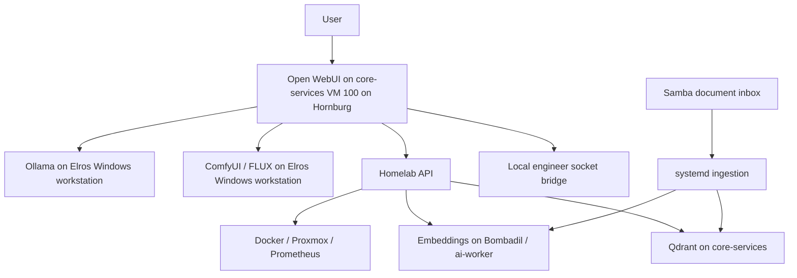

# Local AI Lab

A working self-hosted AI environment built and operated by Logan: Open WebUI on core-services VM 100 on Hornburg, Ollama and ComfyUI on the Elros Windows workstation (historically Citadel), dedicated GPU embeddings, and tools that retrieve knowledge and inspect the lab.

**Documentation synchronized October 6, 2026** against the saved October 4 AI Engineer canonical package. This is a sanitized documentation projection, not a fresh runtime audit. This portfolio distinguishes live observations, historical tests, and unfinished validation.

## Architecture

## Implemented and evidenced

| Area | Recorded evidence and limit |
| --- | --- |
| Chat | Ollama on Elros; October 3 engineer profile used `qwen3.6:35b`; current full model inventory unverified |
| Image generation | Historical ComfyUI/FLUX files and successful logs; current version, workflow and integration not revalidated |
| Dedicated embeddings | Bombadil / VM 102; historical Qwen3-Embedding-4B deployment; October 3 request confirmed 2560 dimensions, not loaded model revision |
| Semantic knowledge | Samba ingestion, Qdrant, provenance-bearing search, and health checks |
| Live tools | Diagnostic/retrieval API; separate bounded engineer bridge observed October 3; complete acceptance pending |
| Specialized assistants | Historical research, diagnostics and design profiles; October 3 `homelab-engineer` profile and `homelab_engineer` tool registration |
| Voice | Historical Faster-Whisper/Kokoro tests; current full path and recovery not revalidated |

The final Basecamp V1 capture recorded 34 sources / 244 points, including retained validation documents. Current role names use **Hornburg** for the Proxmox host, **Elros** for the Windows workstation, and **Bombadil** for VM 102's AI-worker role; Hornburg's native hostname is `hornburg`; the workstation's native Citadel and guest's native ai-worker identities remain distinct from display roles. Compatibility Basecamp paths/routes remain. On October 3, the live knowledge pipeline was additionally hardened with a secret-bearing filename guard and a controlled recovery/reingestion workflow for the Arda operations document. Earlier September 26 inventories differed; [the evidence record](docs/evidence.md) preserves those historical observations. Counts are dated measurements, not corpus-quality or uptime guarantees.

The September 27 Citadel backend connection was repaired in Open WebUI; six models and custom assistants returned while all 99 chats were preserved. See [operations](docs/operations.md).

## Read the project

- [Current state and acceptance limits](docs/current-state.md)
- [Architecture](docs/architecture.md)
- [Image generation and workflow snapshot](docs/image-generation.md)
- [Knowledge pipeline and evaluation](docs/knowledge.md)
- [Model evaluation](docs/model-evaluation.md)
- [Voice history and current limits](docs/voice.md)
- [Assistant profiles](docs/assistants.md)
- [Operations](docs/operations.md) · [Security](docs/security.md)
- [Dated evidence](docs/evidence.md)

Related: [Middle-earth Homelab infrastructure](https://github.com/soonerbear22-ux/basecamp-homelab) · [Homelab API source and tests](https://github.com/soonerbear22-ux/homelab-api)

These are configured integrations and assistant profiles, not newly trained foundation models. No standardized model ranking or hosted-product parity claim is made. Private knowledge contents, endpoints, model weights, and credentials are excluded.

## Authority and closeout

The private canonical package remains authoritative; public documentation excludes its private endpoints, deployment identities and knowledge contents. A01–A03 remain partially resolved and paused. Publication does not establish deployment, ingestion, retrieval or recovery acceptance. An ongoing canonical-to-affected-repository closeout workflow is the next dedicated job; it is not implemented here.
