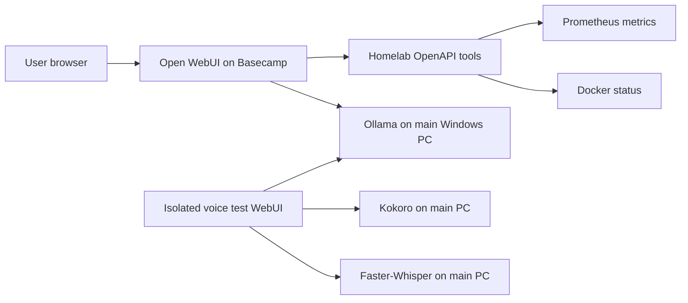

# Local AI Lab

A self-hosted AI environment built and operated by Logan: Open WebUI on Basecamp, Ollama on the main Windows PC, and integrated voice, specialized assistants, and homelab diagnostics.

This repository documents an existing personal lab. It separates operational evidence, owner-confirmed capabilities, and future work. Reviewed September 25, 2026.

## Architecture

The production WebUI and isolated voice test have separate data. Image generation is working according to the owner; its backend is intentionally omitted until a sanitized configuration is available.

## Implemented

| Area | Evidence and scope |
| --- | --- |
| Split inference and application hosting | User-confirmed topology and historical service/model-list output |
| Model evaluation | Repeated owner-reported comparisons across Gemma, DeepSeek, GPT, and Qwen; current preference is the locally installed `qwen3.6:35b` |
| Voice | Faster-Whisper STT and Kokoro TTS; cleaner speech confirmed in an isolated development WebUI |
| Specialized assistants | Research, homelab diagnostics, and 3D print design profiles documented in the setup history |
| Live diagnostics | FastAPI/OpenAPI integration tested from Open WebUI, including disk I/O |
| Image generation | Owner-confirmed working capability; backend and repeatable test details not yet published |

These are configured assistants and integrations, not claims of training foundation models. No claim of parity with a hosted AI product is made.

## Documentation

- [Architecture and boundaries](docs/architecture.md)
- [Model evaluation and evidence](docs/model-evaluation.md)
- [Voice integration](docs/voice.md)
- [Assistant profiles and image generation](docs/assistants.md)
- [Operations and troubleshooting](docs/operations.md)
- [Security and publication scope](docs/security.md)
- [Evidence and roadmap](docs/evidence.md)

Related projects: [Basecamp infrastructure](https://github.com/soonerbear22-ux/basecamp-homelab) · [Homelab API source](https://github.com/soonerbear22-ux/homelab-api)

## Repository scope

This is a sanitized engineering case study, not a one-command deployment. Private addresses, credentials, databases, chat logs, and model weights are excluded. Exact versions, benchmark exports, and reproducible deployment manifests remain follow-up work.
