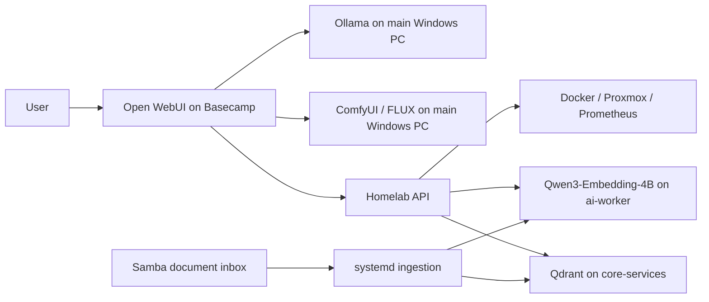

# Local AI Lab

A working self-hosted AI environment built and operated by Logan: Open WebUI on Basecamp, Ollama and ComfyUI on the main Windows PC, dedicated GPU embeddings, and tools that retrieve knowledge and inspect the lab.

**Updated September 26, 2026.** This portfolio distinguishes live observations, historical tests, and unfinished validation.

## Architecture

## Implemented and evidenced

| Area | Current evidence |
| --- | --- |
| Chat | Ollama on the main PC; owner preference is the local tag `qwen3.6:35b` |
| Image generation | ComfyUI 0.37.0, saved FLUX Dev workflow, installed model assets, successful generation logs |
| Dedicated embeddings | RTX 3060 passthrough to ai-worker; Qwen3-Embedding-4B; 2560-dimensional request succeeded |
| Semantic knowledge | Samba ingestion, Qdrant, provenance-bearing search, and health checks |
| Live tools | Thirteen API operations, including Proxmox inventory and a combined audit |
| Specialized assistants | Research, homelab diagnostics, and 3D print design profiles |
| Voice | Historical Faster-Whisper/Kokoro tests; current full path and recovery not revalidated |

The morning knowledge expansion recorded 27 documents / 135 chunks and 28/28 retrieval checks. A later live check found only the two baseline sources in the index. [The evidence record](docs/evidence.md) preserves this discrepancy rather than presenting the earlier total as current.

## Read the project

- [Architecture](docs/architecture.md)
- [Image generation and workflow snapshot](docs/image-generation.md)
- [Knowledge pipeline and evaluation](docs/knowledge.md)
- [Model evaluation](docs/model-evaluation.md)
- [Voice history and current limits](docs/voice.md)
- [Assistant profiles](docs/assistants.md)
- [Operations](docs/operations.md) · [Security](docs/security.md)
- [Dated evidence](docs/evidence.md)

Related: [Basecamp infrastructure](https://github.com/soonerbear22-ux/basecamp-homelab) · [Homelab API source and tests](https://github.com/soonerbear22-ux/homelab-api)

These are configured integrations and assistant profiles, not newly trained foundation models. No standardized model ranking or hosted-product parity claim is made. Private knowledge contents, endpoints, model weights, and credentials are excluded.
